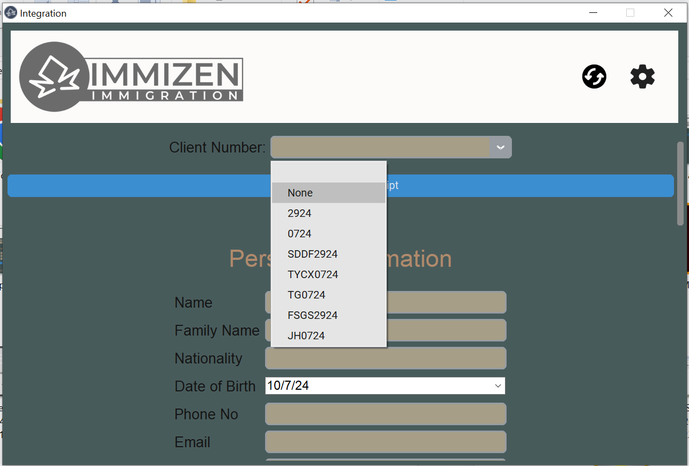
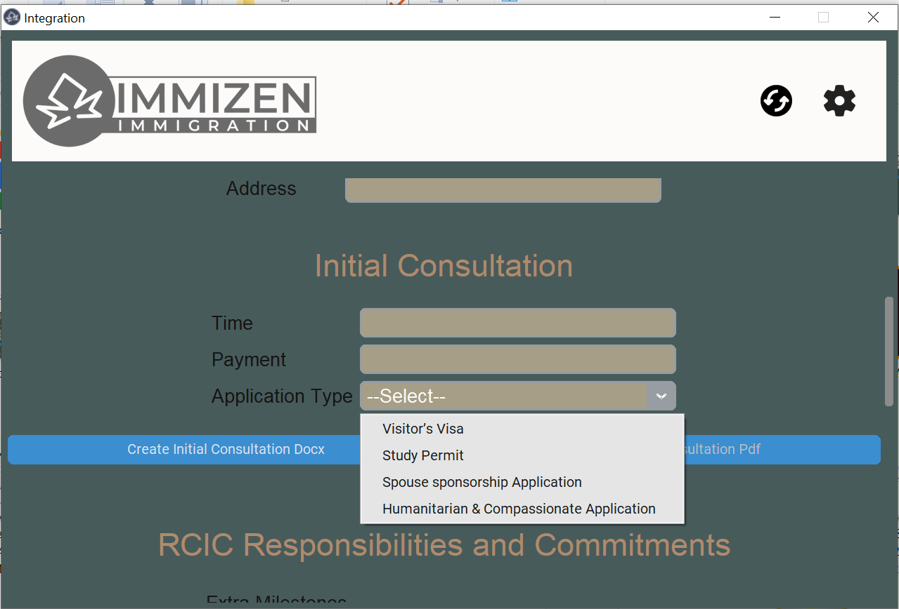
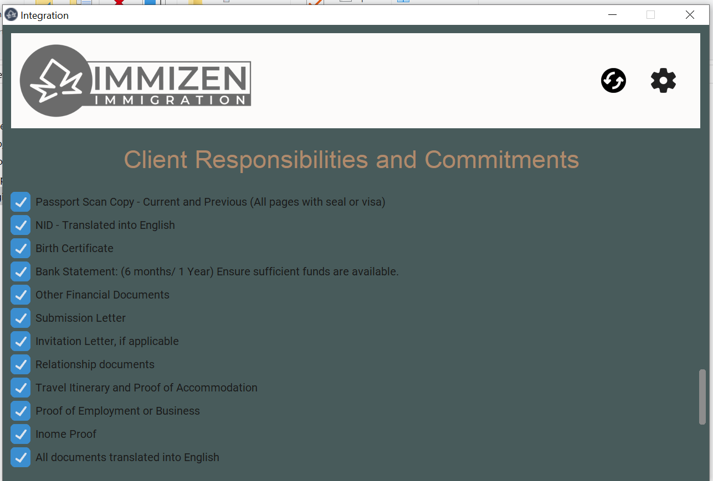
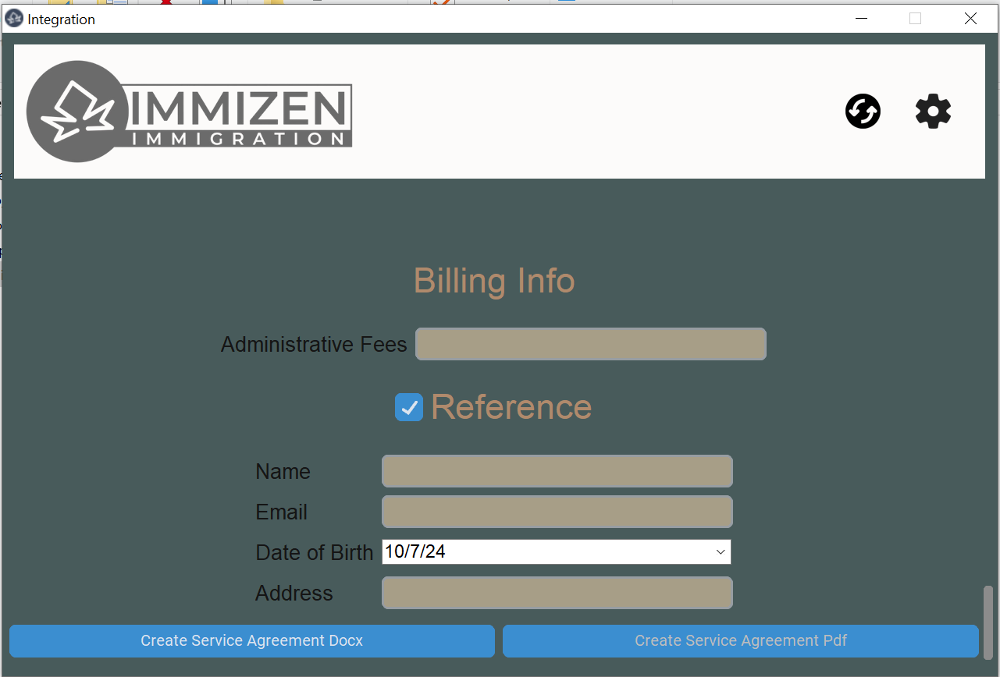

# Immizen Automation App | Desktop Application

A desktop application designed for the **immigration industry** to automate document creation, including service agreements, money receipts, and invoices, streamlining administrative tasks and reducing manual effort.

---

## 🛠️ Skills & Technologies Used
- **Programming Language:** Python  
- **Framework:** Tkinter  
- **Database / Backend:** Supabase  

---

## ⚙️ Features
- Automates creation of **service agreements, money receipts, and invoices**.  
- **Efficient document generation** for faster workflow.  
- **Reduces errors** and manual administrative effort.  

---

## 🖼️ Demo

<div style="display: flex; gap: 10px;">

  
  
  
  

</div>
*Screenshot of the application interface*

---

## 💻 Installation & Setup
1. Clone the repository:  
   ```bash
   git clone https://github.com/your-username/immizen-automation-app.git
